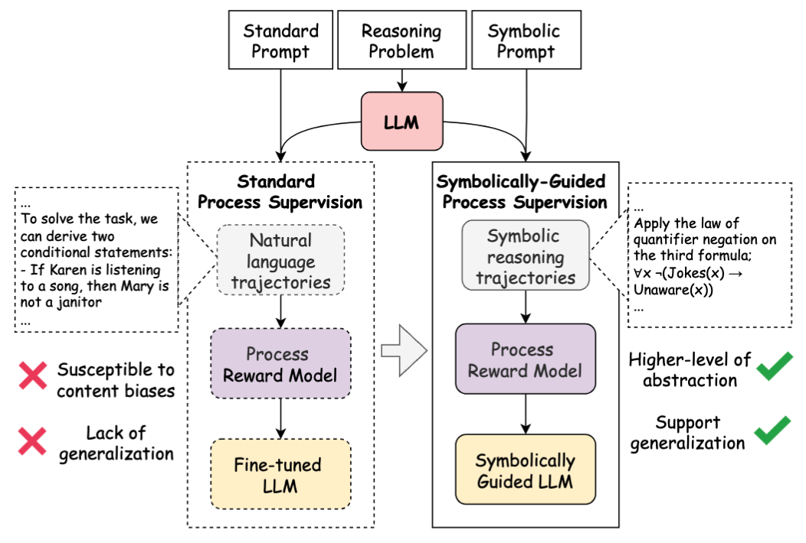

  

    【 📦 <a href="https://huggingface.co/collections/XingweiT/symbreact-trace-68c422ec5edf4750d2f01add">SymbReAct-trace Datasets</a> | 🤗 <a href="https://huggingface.co/papers/2505.20415">Paper</a> 】

# Enhancing Logical Reasoning in Language Models via Symbolically-Guided Monte Carlo Process Supervision
- This work is accepted by EMNLP 2025 as a main research track paper! 🎉
- This is the official repository of the "*Enhancing Logical Reasoning...*". This site stores the experimental code the raw data (i.e., FOLIO, LogicAsker, and PRM-rated stepwise correctness). For the synthetic data for dpo and sft training, please visit our Huggingface.

## TL;DR 

We propose to enhance LLMs' logical reasoning and generalization by synthesizing symbolic reasoning trajectories using Monte Carlo estimation and integrating them with Direct Preference Optimization and Supervised Fine-Tuning.